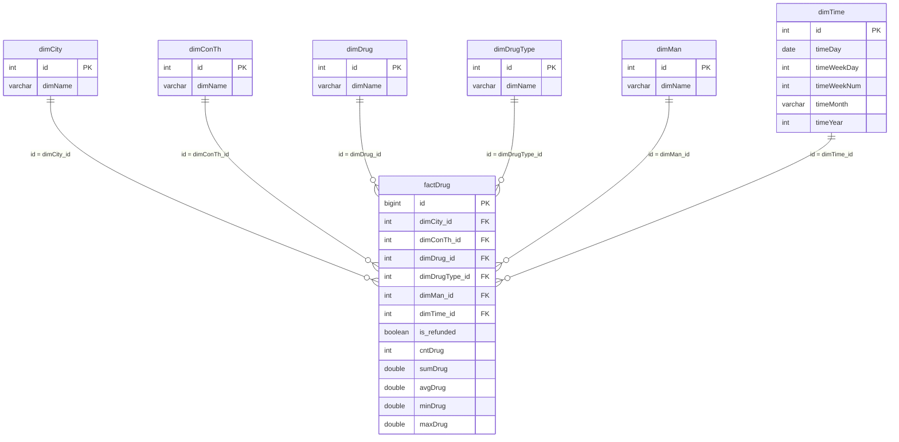

# ERD

This ERD shows the analytical warehouse model used by the dashboard.

## Cardinalities

- `dimCity 1:N factDrug`
- `dimConTh 1:N factDrug`
- `dimDrug 1:N factDrug`
- `dimDrugType 1:N factDrug`
- `dimMan 1:N factDrug`
- `dimTime 1:N factDrug`

## Notes

- `factDrug` is the central fact table.
- Dimension tables keep descriptive attributes and remove repeated text from the fact table.
- `source_ndc_products` and `source_drug_events` are open-data context tables. They are not part of the core sales star schema because the original backup does not contain stable natural keys for direct product/report joins.
