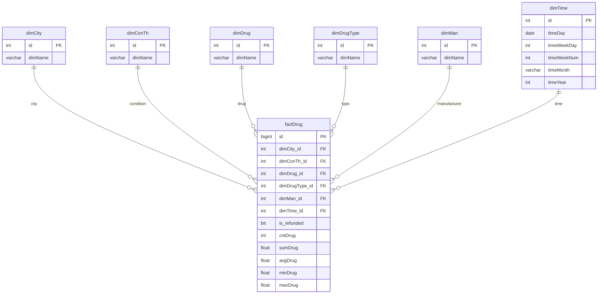

# ERD

To jest prosty schemat hurtowni danych.

```mermaid
erDiagram
    dimCity ||--o{ factDrug : city
    dimConTh ||--o{ factDrug : condition
    dimDrug ||--o{ factDrug : drug
    dimDrugType ||--o{ factDrug : type
    dimMan ||--o{ factDrug : manufacturer
    dimTime ||--o{ factDrug : time

    dimCity {
        int id PK
        varchar dimName
    }

    dimConTh {
        int id PK
        varchar dimName
    }

    dimDrug {
        int id PK
        varchar dimName
    }

    dimDrugType {
        int id PK
        varchar dimName
    }

    dimMan {
        int id PK
        varchar dimName
    }

    dimTime {
        int id PK
        date timeDay
        int timeWeekDay
        int timeWeekNum
        varchar timeMonth
        int timeYear
    }

    factDrug {
        bigint id PK
        int dimCity_id FK
        int dimConTh_id FK
        int dimDrug_id FK
        int dimDrugType_id FK
        int dimMan_id FK
        int dimTime_id FK
        bit is_refunded
        int cntDrug
        float sumDrug
        float avgDrug
        float minDrug
        float maxDrug
    }
```

Najprosciej: `factDrug` trzyma liczby, a tabele `dim...` mowia, czego te liczby dotycza.
